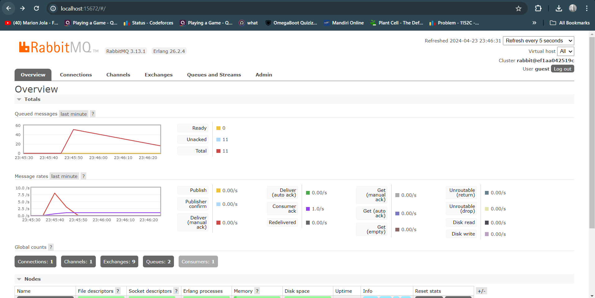
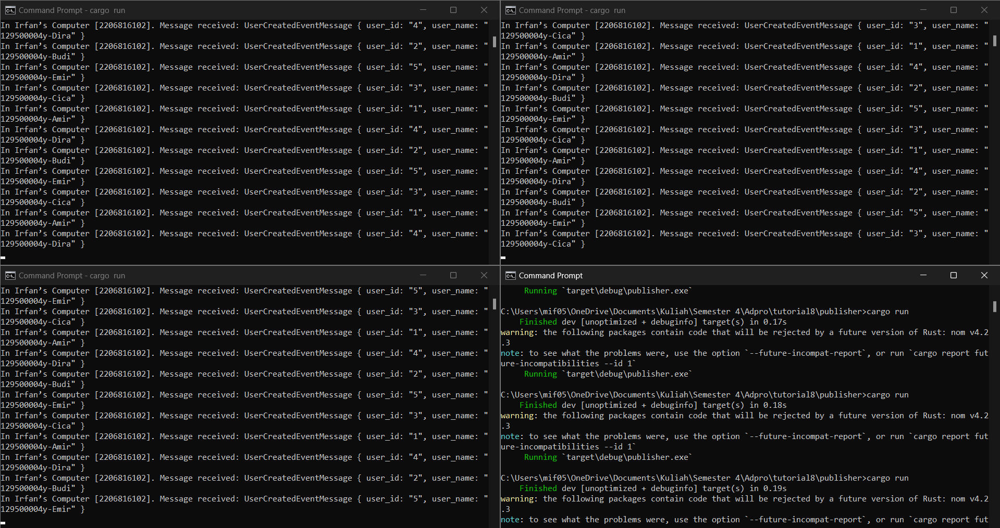

## Understanding subscriber and message broker.

- **what is amqp?**
  
    AMQP adalah singkatan dari Advanced Message Queuing Protocol, yang merupakan protokol jaringan yang dirancang untuk memfasilitasi pertukaran data antara sistem yang terpisah. Protokol ini mendefinisikan aturan-aturan mengenai bagaimana format, pengiriman, penerimaan, dan interpretasi data harus dilakukan. Dengan mengimplementasikan AMQP dalam Rust, kita dapat mengembangkan sistem yang efisien untuk komunikasi antar layanan, memungkinkan pertukaran pesan seperti event, request, atau command meskipun penerima tidak tersedia secara langsung atau tidak terhubung secara langsung dengan pengirim. Dengan kata lain, AMQP di Rust memungkinkan aplikasi di sistem yang berbeda untuk saling bertukar data.
    
- **what it means? guest:guest@localhost:5672 , what is the first quest,and what is the second guest, and what is localhost:5672 is for?**
  
    Dalam konfigurasi guest:guest@localhost:5672, "guest" pertama merujuk pada username yang digunakan untuk mengakses server AMQP, sering kali sebagai pengaturan default dalam pemasangan RabbitMQ lokal. "Guest" kedua adalah password yang dikaitkan dengan username tersebut untuk proses autentikasi. "localhost" menunjukkan bahwa server AMQP dijalankan pada mesin lokal, dan "5672" adalah port yang digunakan oleh server AMQP untuk menerima koneksi. Jadi, string ini menginstruksikan aplikasi untuk terhubung ke server AMQP di mesin lokal menggunakan username "guest" dan password "guest" melalui port 5672.

## Simulation slow subscriber

terlihat bahwa pada waktu tertentu terdapat 50 *queued message*. Ini disebabkan oleh perubahan yang terjadi saat subscriber memerlukan waktu lebih lama untuk memproses pesan yang diterimanya. Hal ini mengakibatkan penumpukan pesan karena subscriber tidak dapat menangani pesan dengan kecepatan secepat yang dikirimkan oleh publisher. Pada saat yang sama, pengulangan perintah cargo run pada publisher juga dapat menyebabkan subscriber mengambil terlalu banyak pesan sekaligus (melalui pengaturan prefetch count), yang kemudian menyebabkan kelebihan beban pada subscriber dalam memproses pesan. Dengan demikian, ketidakseimbangan antara laju pengiriman pesan oleh publisher dan laju pemrosesan pesan oleh subscriber dapat menyebabkan penumpukan pesan dalam antrian.

## Reflection and Running at least three subscribers

Terlihat bahwa peningkatan jumlah subscriber dapat mengurangi jumlah pesan yang tertunda dalam antrian. Ini mengindikasikan bahwa dengan adanya beberapa subscriber, pesan dapat diproses secara simultan. Dengan kata lain, beberapa subscriber dapat bekerja bersama-sama untuk memproses pesan yang masuk, memungkinkan distribusi beban kerja yang lebih merata dan mempercepat waktu respon keseluruhan sistem terhadap pesan yang diterima. Dengan demikian, peningkatan jumlah subscriber dapat menjaga keseimbangan antara laju pengiriman pesan oleh publisher dan laju pemrosesan pesan oleh subscriber, yang berdampak positif pada pengurangan antrian dalam message queue.